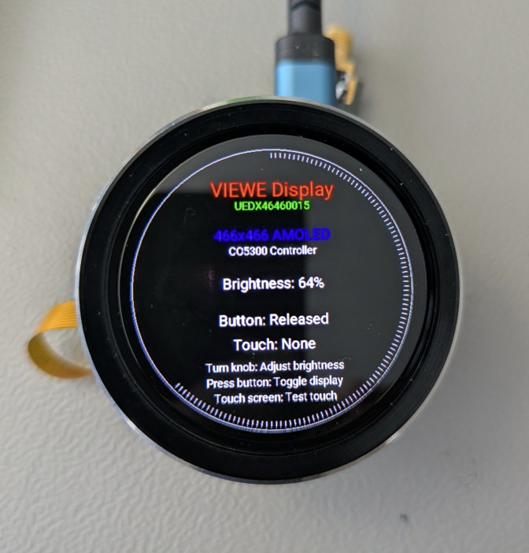
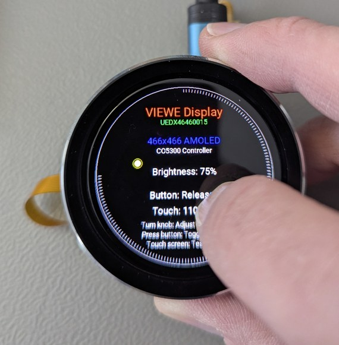
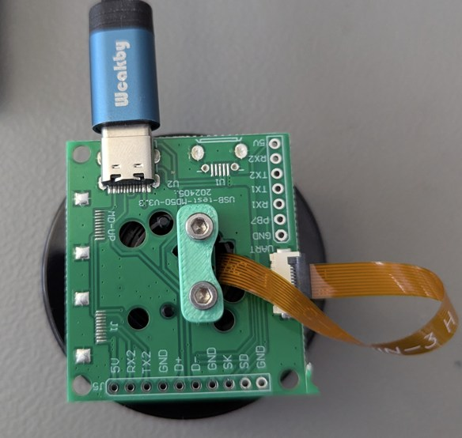

# VIEWE Smart Display UEDX46460015 - ESPHome Configuration

<p align="center">
  
</p>

Complete ESPHome configuration for the **VIEWE UEDX46460015** 1.43" round AMOLED display module with touch screen and rotary encoder.

## 🎯 Features

- ✅ **466×466 AMOLED Display** - CO5300 controller via QSPI
- ✅ **Capacitive Touch** - CST816 controller via I2C
- ✅ **Rotary Encoder** - Brightness control with push button
- ✅ **Hardware Brightness** - 0-255 levels via MIPI DCS commands
- ✅ **Circular UI** - Optimized layout for round display
- ✅ **No Custom Components** - Pure ESPHome configuration

<p align="center">
  
  
</p>

---

## 🚀 Quick Start

### 1. Hardware
- VIEWE Smart Display UEDX46460015 (ESP32-S3 based module with 8MB PSRAM)

### 2. Flash Configuration
```bash
# Clone this repository
git clone https://github.com/STB3/esphome-Viewe_UEDX4646
cd viewe-display-esphome

# Edit WiFi credentials in viewe-uedx46460015-example.yaml
# Change lines 56-57:
#   ssid: "YourWiFiName"
#   password: "YourWiFiPassword"

# Flash to device
esphome run viewe-uedx46460015-example.yaml
```

### 3. Use It!
- **Turn encoder knob** → Adjust brightness
- **Press button** → Toggle display on/off
- **Touch screen** → View coordinates
- **Web interface** → http://device-ip

---

## 📋 Pin Configuration

| Component | Pin | GPIO |
|-----------|-----|------|
| **Display (QSPI)** |
| QSPI Clock | CLK | GPIO10 |
| QSPI Data 0-3 | D0-D3 | GPIO13, 11, 14, 9 |
| Chip Select | CS | GPIO12 |
| Reset | RST | GPIO8 |
| **Power** | VCI_EN | **GPIO17** ⚠️ |
| **Touch (I2C)** |
| I2C SDA | SDA | GPIO1 |
| I2C SCL | SCL | GPIO3 |
| **Encoder** |
| Encoder A | A | GPIO5 |
| Encoder B | B | GPIO6 |
| Push Button | SW | GPIO0 |

⚠️ **CRITICAL:** GPIO17 must be HIGH to power the display module!

---

## 🔧 Key Configuration Details

### Display Offset
```yaml
dimensions:
  offset_width: 6  # CO5300 framebuffer offset
```
The CO5300 has a 472-pixel framebuffer but shows columns 6-471. Without this offset, you'll see 6 green vertical lines on the right edge.

### Buffer Size
```yaml
buffer_size: 100%  # Prevents artifacts
```
Full buffer prevents horizontal line artifacts. ESP32-S3 with 8MB PSRAM handles this easily.

### LCD Power (GPIO17)
```yaml
on_boot:
  - lambda: |-
      gpio_set_direction(GPIO_NUM_17, GPIO_MODE_OUTPUT);
      gpio_set_level(GPIO_NUM_17, 1);
```
GPIO17 powers the **entire LCD module**, not just a backlight as written in the schematics. Must be HIGH before display initialization.

---

## 🐛 Troubleshooting

| Problem | Solution |
|---------|----------|
| Display stays black | Verify GPIO17 is set HIGH in `on_boot` |
| 6 green vertical lines | Add `offset_width: 6` in dimensions |
| Horizontal corrupted line | Set `buffer_size: 100%` |
| Touch not responding | Check I2C pins (SDA: GPIO1, SCL: GPIO3) |
| Encoder direction reversed | Swap `pin_a` and `pin_b` |

---

## 📖 Documentation

- [ESPHome mipi_spi Docs](https://esphome.io/components/display/mipi_spi/) - Official display driver documentation

- [Viewsmart GitHub] (https://github.com/VIEWESMART/UEDX46460015-MD50ESP32-1.5inch-Touch-Knob-Display/tree/main) - Offocial Viewe GitHub
---

## 🤝 Contributing

Found an issue or have an improvement? Feel free to:
- Open an issue
- Submit a pull request
- Share your modifications

---

## 📄 License

This configuration is provided as-is for the ESPHome community. Feel free to use and modify for your projects.

---

## ⭐ Acknowledgments

- **ESPHome Team** - For the excellent mipi_spi display driver
- **ESPHome Community** - For support and feedback

---

**If this helped you, please give it a ⭐ star!**

---

**Questions?** Open an issue or visit the [ESPHome forum post](#)!
